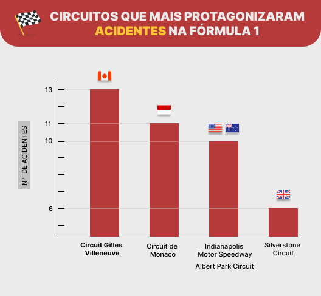
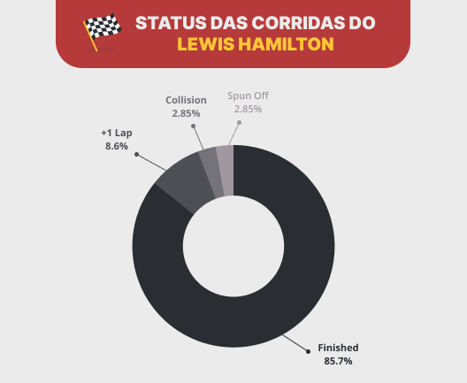

# 🏁 Fórmula 1 Database

> Projeto final desenvolvido no 3º módulo do curso de Desenvolvimento Web FullStack no
> programa B2B Geração Futuro (Resilia + Stone).

## Descrição

O propósito desse projeto é criar visualizações de dados com base nas consultas
realizadas no banco de dados escolhido (Fórmula 1).

O conjunto de dados utilizado contém as informações sobre o universo da Fórmula 1, permitindo a análise e consulta dos construtores, pilotos, qualificações, circuitos, tempos de volta, pit stops, entre outros.

## Ferramentas Utilizadas

- [x] MySQL WorkBench
- [x] The Open Source Firebase (Supabase)
- [x] Figma (Confecção dos gráficos)
- [x] Trello (Organização da Squad)

## Queries

### [ 1 ] Query

### [ 2 ] Query

### [ 3 ] Circuitos que mais protagonizaram acidentes.

```sql
SELECT 
  C.name as circuito,
  C.country,
  S.status, 
  count(*) as acidentes
FROM f1_circuits as C
LEFT JOIN 
  f1_races as RA on C.circuitId = RA.circuitId
LEFT JOIN 
  f1_results as RE on RA.raceId = RE.raceId
LEFT JOIN 
  f1_status as S on S.statusId = RE.statusId
GROUP BY circuito, C.country, S.status
HAVING S.status = 'Accident' 
ORDER by acidentes desc;
```


### [ 4 ] Query

## Lewis Hamilton

> Destacamos as estatísticas do piloto Lewis Hamilton no processo de desenvolvimento das queries.

### [ 5 ] Query

### [ 6 ] Status das corridas.

```sql
SELECT 
  D.forename,
  D.surname,
  C.name as circuito,
  RE.statusId,
  S.status
FROM f1_circuits as C 
LEFT JOIN 
  f1_races as RA on C.circuitId = RA.circuitId
LEFT JOIN 
  f1_results as RE on RE.raceId = RA.raceId
LEFT JOIN 
  f1_drivers as D on RE.driverId = D.driverId
LEFT JOIN 
  f1_status as S on RE.statusId = S.statusId
WHERE  D.forename = 'Lewis' and D.surname = 'Hamilton'
GROUP BY D.forename, D.surname, RE.statusId, S.status, circuito;
```

### [ 7 ] Query

### [ 8 ] Query

## WebSite

Desenvolvemos um site para melhor visualização dos gráficos. [Acesse aqui]().

## Squad

- [Ellen Maria](https://github.com/ellenmariadev/)
- [Jéssica Bispo](https://github.com/jessbispo)
- [Lhaís Costa](https://github.com/LhaisCosta99)
- [Rio Ribeiro](https://github.com/rioribeirods)
