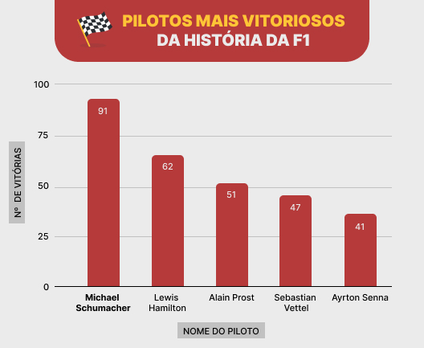
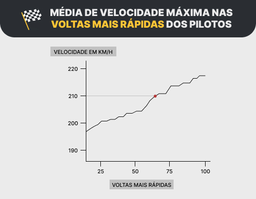
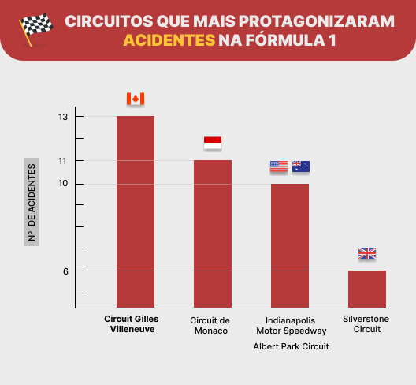
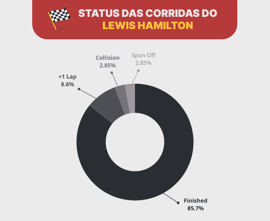
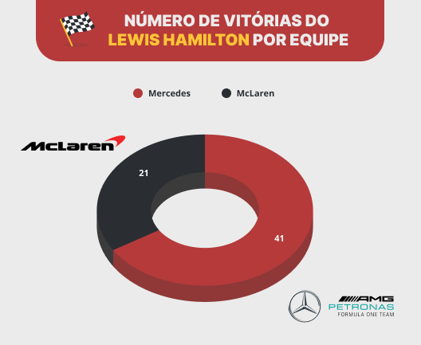
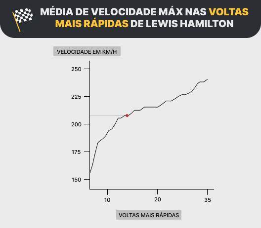

# 🏁 Fórmula 1 Database

> Projeto final desenvolvido no 3º módulo do curso de Desenvolvimento Web FullStack no
> programa B2B Geração Futuro (Resilia + Stone).

## Descrição 

O propósito desse projeto é criar visualizações de dados com base nas consultas
realizadas no banco de dados escolhido (Fórmula 1).

O conjunto de dados contém as informações sobre o universo da Fórmula 1, permitindo a análise e consulta dos construtores, pilotos, qualificações, circuitos, tempos de volta, pit stops, entre outros.

## 🛠 Ferramentas Utilizadas 

- [x] MySQL WorkBench
- [x] The Open Source Firebase (Supabase)
- [x] Figma (Confecção dos gráficos)
- [x] Trello (Organização da Squad)

## 🔎 Queries 
<details>
<summary><strong>[ 1 ] Pilotos mais vitoriosos da F1.</strong></summary>
</br>



```sql
SELECT
  pilotos.piloto_id, pilotos.nome, pilotos.sobrenome, COUNT(resultados.position) AS numero_vitorias 
FROM
  resultados
INNER JOIN
  pilotos on resultados.driverId = pilotos.piloto_Id
WHERE
  resultados.position = 1
GROUP BY
  pilotos.piloto_Id
ORDER BY
  numero_vitorias desc limit 5;
```
</details>

<details>
<summary><strong>[ 2 ] Média de velocidade máxima nas voltas mais rápidas dos pilotos.</strong></summary>
</br>



```sql
SELECT "fastestLapSpeed" 
AS MAX_VELOCIDADE 
FROM "F1_resultados" 
WHERE "resultId" <100 
ORDER BY "fastestLapSpeed" 
ASC;

SELECT AVG("fastestLapSpeed") 
AS MAX_VELOCIDADE 
FROM "F1_resultados" 
WHERE "resultId" < 100;
```
</details>

<details>
<summary><strong>[ 3 ] Nacionalidade dos corredores que atingiram as maiores velocidades em uma única volta.</strong></summary>
</br>


```sql
SELECT 
  "F1_drivers".forename,
  "F1_drivers".surname,
  "F1_drivers".nationality,
  "F1_results"."raceId" AS corrida,
  "F1_results"."fastestLapSpeed" AS velocidade
FROM 
  "F1_results"
INNER JOIN
  "F1_drivers" ON  "F1_results"."driverId" = "F1_drivers"."driverId" 
WHERE 
  "F1_results"."statusId" = 1
GROUP BY
  "F1_drivers".forename,
  "F1_drivers".surname,
  "F1_results"."raceId",
  "F1_drivers".nationality,
  "F1_results"."fastestLapSpeed"
ORDER BY
 "fastestLapSpeed" DESC 
LIMIT 5;
```
</details>
<details>
<summary><strong>[ 4 ] Circuitos que mais protagonizaram acidentes.</strong></summary>
</br>



```sql
SELECT
  C.name as circuito,
  C.country,
  S.status,
  count(*) as acidentes
FROM f1_circuits as C
LEFT JOIN
  f1_races as RA on C.circuitId = RA.circuitId
LEFT JOIN
  f1_results as RE on RA.raceId = RE.raceId
LEFT JOIN
  f1_status as S on S.statusId = RE.statusId
GROUP BY circuito, C.country, S.status
HAVING S.status = 'Accident'
ORDER by acidentes desc;
```
</details>

<details>
<summary><strong>[ 5 ] Restrospecto dos pilotos na história da Mercedes.</strong></summary>
</br>


```sql
SELECT
    pilotos.piloto_Id,
    pilotos.nome,
    pilotos.sobrenome,
    construtores.nome,
    COUNT(resultados.position) AS numero_vitorias
FROM
    resultados
        INNER JOIN
    pilotos ON resultados.driverId = pilotos.piloto_Id
        INNER JOIN
    construtores ON resultados.constructorId = construtores.constructor_Id
WHERE
    position = 1
        AND construtores.nome = 'Mercedes'
GROUP BY construtores.nome , pilotos.piloto_Id
ORDER BY numero_vitorias DESC
LIMIT 5;
```
</details>

<details>
<summary><strong>[ 6 ] Restrospecto dos pilotos na história da McLaren.</strong></summary>
</br>


```sql
SELECT 
  pilotos.piloto_Id,
  pilotos.nome,
  pilotos.sobrenome,
  construtores.nome,
  COUNT(resultados.position) AS numero_vitorias
FROM
  resultados
INNER JOIN
  pilotos ON resultados.driverId = pilotos.piloto_Id
INNER JOIN
    construtores ON resultados.constructorId = construtores.constructor_Id
WHERE
  position = 1
AND construtores.nome = 'McLaren'
GROUP BY construtores.nome , pilotos.piloto_Id
ORDER BY numero_vitorias DESC
LIMIT 5;
```
</details>

## Lewis Hamilton 

> Destacamos as estatísticas do piloto Lewis Hamilton no processo de desenvolvimento das queries.

<details>
<summary><strong>[ 7 ] 5 voltas mais rapidas realizadas por Lewis Hamilton.</strong></summary>
</br>


```sql
SELECT 
  "F1_drivers".forename,
  "F1_drivers".surname,
  "F1_results"."raceId" AS corrida,
  "F1_races".name AS circuito,
  "F1_results"."fastestLapTime" AS tempo
FROM 
  "F1_results"
INNER JOIN
  "F1_drivers" ON  "F1_results"."driverId" = "F1_drivers"."driverId"
  INNER JOIN
  "F1_races" ON "F1_results"."raceId" = "F1_races"."raceId"
WHERE 
  "F1_results"."statusId" = 1 
  AND "F1_drivers"."driverId" = '1' 
GROUP BY
  "F1_drivers".forename,
  "F1_drivers".surname,
  "F1_results"."raceId",
  "F1_races".name,
  "F1_results"."fastestLapTime"
ORDER BY
 "fastestLapTime" ASC
LIMIT 5;
```
</details>

<details>
<summary><strong>[ 8 ] Status das corridas.</strong></summary>
</br>



```sql
SELECT
  D.forename,
  D.surname,
  C.name as circuito,
  RE.statusId,
  S.status
FROM f1_circuits as C
LEFT JOIN
  f1_races as RA on C.circuitId = RA.circuitId
LEFT JOIN
  f1_results as RE on RE.raceId = RA.raceId
LEFT JOIN
  f1_drivers as D on RE.driverId = D.driverId
LEFT JOIN
  f1_status as S on RE.statusId = S.statusId
WHERE  D.forename = 'Lewis' and D.surname = 'Hamilton'
GROUP BY D.forename, D.surname, RE.statusId, S.status, circuito;
```
</details>

<details>
<summary><strong>[ 9 ] Em qual equipe Lewis Hamilton teve mais vitórias.</strong></summary>
</br>



```sql
SELECT
    pilotos.piloto_Id,
    pilotos.nome,
    pilotos.sobrenome,
    construtores.nome,
    COUNT(resultados.position) AS numero_vitorias
FROM
    resultados
        INNER JOIN
    pilotos ON resultados.driverId = pilotos.piloto_Id
        INNER JOIN
    construtores ON resultados.constructorId = construtores.constructor_Id
WHERE
    position = 1
        AND pilotos.sobrenome = 'Hamilton'
GROUP BY construtores.nome , pilotos.piloto_Id;
```
</details>

<details>
<summary><strong>[ 10 ] Média de velocidade máxima nas voltas mais rápidas de Lewis Hamilton</strong></summary>
</br>



```sql
SELECT "fastestLapSpeed" 
AS MAX_VELOCIDADE 
FROM "F1_resultados" 
WHERE "driverId" = 1 
ORDER BY "fastestLapSpeed" ASC;

SELECT AVG("fastestLapSpeed") 
AS MAX_VELOCIDADE 
FROM "F1_resultados" 
WHERE "driverId" = 1;

```

</details>

## 🌐 WebSite

Desenvolvemos um site para melhor visualização dos gráficos. [Acesse aqui](https://jessbispo.github.io/modulo3/).

## Squad

- [Ellen Maria](https://github.com/ellenmariadev/)
- [Jéssica Bispo](https://github.com/jessbispo)
- [Lhaís Costa](https://github.com/LhaisCosta99)
- [Rio Ribeiro](https://github.com/rioribeirods)
